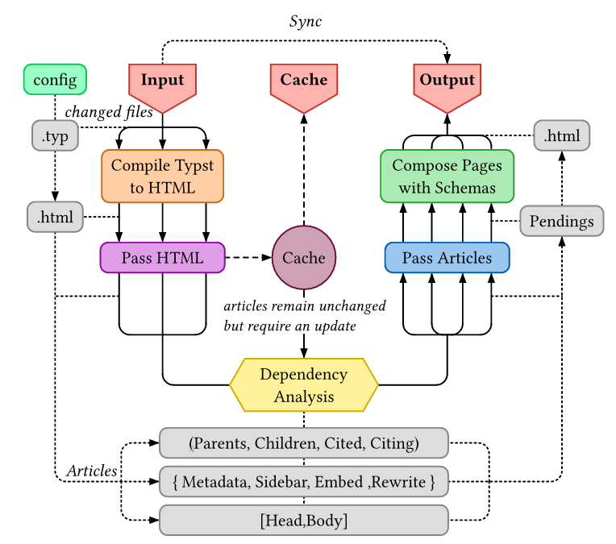

# Typsite
[ [English](./README.md) | **中文** ]

<div style="text-align: center;">

</div>

## 1. 介绍

Typsite 是一个用于构建静态网站的工具，其文章内容由纯 `Typst` 编写，经由 `Typsite` 进行处理后，最终生成一个健全的静态站点。


## 2. 功能

- `Typst` 的常规表达
- 框架: 标题递增、小节模板、侧边栏、页脚
- 富文本：段落、小节、引用、代码块、数学公式、注脚、页面嵌入
- 将 Typst math 转换为 Mathml （自动检测math-font)
- 支持现代 Web 技术规范，如 HTML5、CSS3 和 JavaScript（ES6+）
- 自动安装 typst-packages, 在 watch-mode 下自动同步包文件
- 增量编译, 实时预览

## 3. Typst 简介

Typst 是一种现代化的排版系统，类似于 LaTeX，但设计更为简洁、易学，它主要用于创建学术论文、书籍、报告等需要精美排版的文档。

你可以在这里查看其官方英文文档：[Typst Document](https://typst.app/docs/)
对于Typst的中文教程，我强烈推荐：[Typst 蓝书](https://typst-doc-cn.github.io/tutorial/introduction.html) (天呐，这位编者非常清楚地知道自己是在阐述一套本体论!).

此节的剩余部分将会介绍 Typst & HTML -> Typsite

### 3.1 Typst 的 HTML 导出功能

Typst 于 `0.13` 增加了 HTML 导出功能，包括 `html-export` 模式以及两个核心函数：`html.elem` 和 `html.frame` —— 我们可以利用这些函数来基于 Typst 编写以HTML+CSS为目标内容。

### 3.2 Typsite：基于 Typst 的静态站点生成器

受此启发，我用 `Rust` 开发了名为 `Typsite` 的静态站点生成器.

目前，Typst 的 HTML 导出:
- 对简单富文本已有良好支持
- 复杂样式需要用户通过 `html.elem` 函数手动编写
- 无法自动将所有 Typst 生态内容转换为 HTML
- 对于包含复杂 Typst 样式的内容，可以使用 `html.frame` 将其转为 SVG 并嵌入 HTML
- 对于每一次 compile, 只支持单文件 HTML 输出

对于详细的已支持内容与计划可以追踪这个 [issue: HTML export #5512](https://github.com/typst/typst/issues/5512)

虽然官方有计划支持自动 typst style -> HTML+CSS，但这并不会与 Typsite 产生任何冲突。 恰恰相反，Typst 的发展将使 Typsite 更加实用，因为 `Typsite` 主要职能是协调文章间的交互，并最终构建一套功能完善的静态网站。

## 4. 安装

- 通过模板: [Typsite Template](https://github.com/Glomzzz/typsite-template) (推荐, for linux / macos)
- 通过 [Release 页面](https://github.com/Glomzzz/typsite/releases/latest)下载二进制文件
    - 请确保你已安装了**0.13+**的typst
- 通过 Nix & Flakes 构建
    - 请确保你已经开启了 `experimental-features = nix-command flakes`

```shell
git clone https://github.com/Glomzzz/typsite.git

cd typsite
nix build .
```

## 5. 架构 & 流程



你可以在 [Typsite 文档](https://typ.rowlib.com) 查看更多教程与示例

## 贡献 

来和我一起壮大typsite!

## 鸣谢
- [kokic](https://github.com/kokic) : [kodama](https://github.com/kokic/kodama) for **Markdown + Typst + LaTeX SSG**
